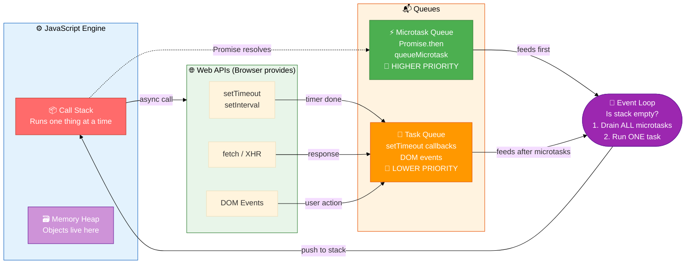
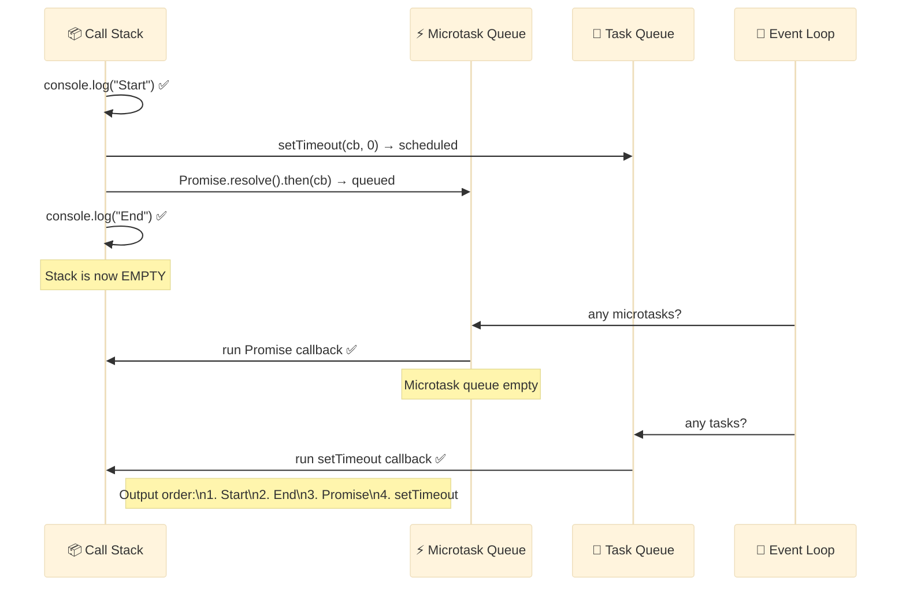

# Event Loop in JavaScript

JavaScript is **single-threaded** — it runs one piece of code at a time. The **Event Loop** is the mechanism that allows JS to handle async operations without blocking.

### How it works:
```
Call Stack  →  Web APIs  →  Task Queue / Microtask Queue  →  Event Loop picks up tasks
```

| Queue | What goes in | Priority |
|-------|-------------|----------|
| **Microtask Queue** | Promise `.then`, `queueMicrotask`, `MutationObserver` | ⬆️ Higher |
| **Task Queue** (Macrotask) | `setTimeout`, `setInterval`, DOM events, `fetch` callbacks | ⬇️ Lower |

> **Rule:** All microtasks run before the next task from the task queue.

---

## Visual Overview — Event Loop Architecture



## Visual Overview — Execution Order



---

## Example 1 — Basic

```js
// Execution order demonstration
console.log("1 - Start");            // sync → call stack

setTimeout(() => {
  console.log("2 - setTimeout");     // macrotask → task queue
}, 0);

Promise.resolve().then(() => {
  console.log("3 - Promise");        // microtask → microtask queue
});

console.log("4 - End");              // sync → call stack

// Output order:
// 1 - Start
// 4 - End
// 3 - Promise     ← microtask runs before setTimeout
// 2 - setTimeout  ← macrotask runs last
```

---

## Example 2 — Intermediate

```js
// Microtasks vs Macrotasks in detail
console.log("Script start");

setTimeout(() => console.log("setTimeout 1"), 0);
setTimeout(() => console.log("setTimeout 2"), 0);

Promise.resolve()
  .then(() => console.log("Promise 1"))
  .then(() => console.log("Promise 2")); // chained microtask

queueMicrotask(() => console.log("queueMicrotask"));

console.log("Script end");

// Output:
// Script start
// Script end
// Promise 1          ← microtasks first
// Promise 2          ← chained microtask
// queueMicrotask     ← microtask
// setTimeout 1       ← macrotasks after ALL microtasks
// setTimeout 2

// Blocking the event loop — bad practice!
function blockingTask() {
  const start = Date.now();
  while (Date.now() - start < 2000) {}  // blocks for 2 seconds
  console.log("Done blocking");
}

// This prevents any UI updates or other tasks for 2 seconds
// blockingTask(); // ❌ never do this

// Non-blocking alternative using chunked processing
function processInChunks(data, chunkSize = 100) {
  let index = 0;

  function processNextChunk() {
    const chunk = data.slice(index, index + chunkSize);
    chunk.forEach(item => { /* process */ });
    index += chunkSize;

    if (index < data.length) {
      setTimeout(processNextChunk, 0); // yield to event loop between chunks
    }
  }

  processNextChunk();
}
```

---

## Example 3 — Advanced

```js
// async/await and the event loop
async function asyncExample() {
  console.log("A - async start");

  await Promise.resolve(); // yields here — rest goes to microtask queue

  console.log("B - after await"); // runs as microtask
}

console.log("1 - before async call");
asyncExample();
console.log("2 - after async call (sync continues)");

// Output:
// 1 - before async call
// A - async start       ← sync inside async runs immediately
// 2 - after async call  ← calling code continues
// B - after await       ← microtask resumes

// setImmediate vs setTimeout vs process.nextTick (Node.js)
// process.nextTick → runs before any I/O, before promises
// Promise.then     → microtask queue
// setImmediate     → check phase of event loop
// setTimeout(0)    → timer phase

// Task starvation — too many microtasks can block macrotasks
function createMicrotaskLoop() {
  let count = 0;
  function recurse() {
    if (count++ < 1000000) {
      Promise.resolve().then(recurse); // creates 1 million microtasks
    }
  }
  recurse();
}
// ⚠️ This would delay all setTimeout callbacks for a long time

// Real-world pattern: batching DOM updates with microtasks
class BatchUpdater {
  #updates = [];
  #scheduled = false;

  add(updateFn) {
    this.#updates.push(updateFn);

    if (!this.#scheduled) {
      this.#scheduled = true;
      // Run all updates in the same microtask flush (before next render)
      queueMicrotask(() => {
        this.#updates.forEach(fn => fn());
        this.#updates = [];
        this.#scheduled = false;
      });
    }
  }
}

const updater = new BatchUpdater();
updater.add(() => console.log("Update 1"));
updater.add(() => console.log("Update 2"));
updater.add(() => console.log("Update 3"));
// All 3 run together in one microtask flush
```
