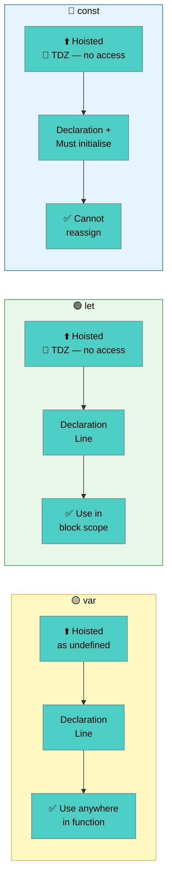

# Variables in JavaScript

Variables are containers that store data values. JavaScript has 3 ways to declare variables: `var`, `let`, and `const`.

| Keyword | Scope | Re-declare | Update | Hoisted |
|---------|-------|------------|--------|---------|
| `var` | Function | ✅ Yes | ✅ Yes | ✅ Yes (as undefined) |
| `let` | Block | ❌ No | ✅ Yes | ❌ No |
| `const` | Block | ❌ No | ❌ No | ❌ No |

> **Rule of thumb:** Always use `const` by default. Use `let` when you need to reassign. Avoid `var`.

---

## Visual Overview



### Temporal Dead Zone (TDZ)
The **TDZ** is the period between entering a block and the `let`/`const` declaration line. Accessing the variable in this window throws a `ReferenceError`.

```js
// var — hoisted and initialized as undefined (no TDZ)
console.log(a); // undefined (no error)
var a = 10;

// let — hoisted but NOT initialized → TDZ from top of block to declaration line
console.log(b); // ❌ ReferenceError: Cannot access 'b' before initialization
let b = 10;

// const — same TDZ behaviour as let
console.log(c); // ❌ ReferenceError
const c = 10;
```

### `const` in loops
`const` **cannot** be used as a loop counter because it cannot be reassigned. Use `let` instead.

```js
// for (const i = 0; i < 3; i++) {} // ❌ TypeError: Assignment to constant variable

for (let i = 0; i < 3; i++) {}      // ✅ let works

// const IS fine in for...of / for...in (new binding each iteration)
const items = ["a", "b", "c"];
for (const item of items) {
  console.log(item); // ✅ a, b, c — new const binding each loop
}
```

---

## Example 1 — Basic

```js
// var — old way, avoid in modern JS
var city = "Chennai";
var city = "Mumbai"; // re-declaration allowed
console.log(city); // Mumbai

// let — use when value changes
let score = 10;
score = 20; // update allowed
console.log(score); // 20

// const — use when value never changes
const PI = 3.14159;
console.log(PI); // 3.14159
// PI = 3; ❌ TypeError: Assignment to constant variable
```

---

## Example 2 — Intermediate

```js
// Block scope: let vs var inside if block
function checkScope() {
  if (true) {
    var a = "I am var";   // accessible outside if block
    let b = "I am let";   // only accessible inside if block
  }

  console.log(a); // "I am var"
  console.log(b); // ❌ ReferenceError: b is not defined
}

checkScope();
```

```js
// Hoisting: var is hoisted (initialized as undefined), let is NOT
console.log(x); // undefined (hoisted)
var x = 5;

console.log(y); // ❌ ReferenceError: Cannot access 'y' before initialization
let y = 10;
```

---

## Example 3 — Advanced

```js
// const with objects — the reference is constant, but properties can change
const user = { name: "Alice", age: 25 };

user.age = 26;         // ✅ allowed — modifying property
user.city = "Delhi";   // ✅ allowed — adding new property
console.log(user);     // { name: 'Alice', age: 26, city: 'Delhi' }

// user = {};  ❌ TypeError: Assignment to constant variable

// const with arrays
const fruits = ["apple", "banana"];
fruits.push("mango");  // ✅ allowed
console.log(fruits);   // ['apple', 'banana', 'mango']

// Practical pattern: use const for objects/arrays, let for primitives
const config = {
  apiUrl: "https://api.example.com",
  timeout: 3000,
};

config.timeout = 5000; // ✅ fine — updating a property
console.log(config.timeout); // 5000
```
