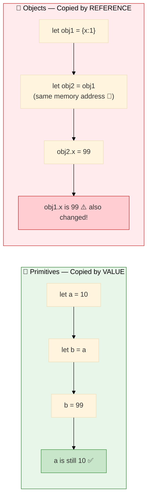

# Data Types in JavaScript

JavaScript has **8 data types** split into two categories:

### Primitive (stored by value)
| Type | Example |
|------|---------|
| `string` | `"hello"` |
| `number` | `42`, `3.14` |
| `boolean` | `true`, `false` |
| `null` | `null` |
| `undefined` | `undefined` |
| `bigint` | `9007199254740991n` |
| `symbol` | `Symbol("id")` |

> **`null` vs `undefined`:**
> - `null` — explicitly set to "no value" by the developer
> - `undefined` — JS assigned it because no value was provided

### Non-Primitive (stored by reference)
| Type | Example |
|------|---------|
| `object` | `{}`, `[]`, `null` |

> Use `typeof` to check the type of a value.

---

## Primitive vs Non-Primitive

| Feature             | Primitive                     | Non-Primitive                         |
|---------------------|-------------------------------|---------------------------------------|
| **Storage**         | Stack (by value)              | Heap (by reference, pointer on stack) |
| **Mutability**      | Immutable                     | Mutable                               |
| **Equality check**  | Compares value                | Compares reference                    |
| **Examples**        | `number`, `string`, `boolean` | `Array`, `Object`, `Function`         |

```js
// Primitive — copied by value
let a = 10;
let b = a;
b = 20;
console.log(a); // 10 — unchanged

// Non-primitive — copied by reference
let arr1 = [1, 2, 3];
let arr2 = arr1;
arr2.push(4);
console.log(arr1); // [1, 2, 3, 4] — affected!
```

---

## Visual Overview



---

## Example 1 — Basic

```js
// Primitive types
let name = "John";           // string
let age = 30;                // number
let isLoggedIn = true;       // boolean
let score = null;            // null (intentionally empty)
let address;                 // undefined (not assigned)

console.log(typeof name);       // "string"
console.log(typeof age);        // "number"
console.log(typeof isLoggedIn); // "boolean"
console.log(typeof score);      // "object"  ← known JS quirk, null shows as object
console.log(typeof address);    // "undefined"
```

---

## Example 2 — Intermediate

```js
// Type coercion — JS automatically converts types in some operations

console.log("5" + 3);    // "53"  → number converted to string (concatenation)
console.log("5" - 3);    // 2     → string converted to number (subtraction)
console.log(true + 1);   // 2     → true = 1
console.log(false + 1);  // 1     → false = 0
console.log(null + 1);   // 1     → null = 0
console.log(undefined + 1); // NaN

// Explicit conversion
let strNum = "42";
console.log(Number(strNum));    // 42
console.log(String(99));        // "99"
console.log(Boolean(0));        // false
console.log(Boolean("hello"));  // true
console.log(Boolean(""));       // false

// Falsy values: false, 0, "", null, undefined, NaN
// Everything else is truthy
```

---

## Example 3 — Advanced

```js
// Primitive vs Reference (by value vs by reference)

// Primitives — copied by VALUE
let a = 10;
let b = a;
b = 20;
console.log(a); // 10 — original unchanged

// Objects — copied by REFERENCE
let obj1 = { x: 1 };
let obj2 = obj1;  // both point to same object in memory
obj2.x = 99;
console.log(obj1.x); // 99 — original changed!

// To properly copy an object (shallow clone):
let obj3 = { ...obj1 };  // spread operator
let obj4 = Object.assign({}, obj1);

obj3.x = 100;
console.log(obj1.x); // 99 — original safe now

// Deep clone (for nested objects):
let nested = { a: { b: 1 } };
let deepCopy = JSON.parse(JSON.stringify(nested));
deepCopy.a.b = 999;
console.log(nested.a.b); // 1 — original safe

// Symbol — unique identifier
const id1 = Symbol("id");
const id2 = Symbol("id");
console.log(id1 === id2); // false — every Symbol is unique

// BigInt — for numbers beyond Number.MAX_SAFE_INTEGER
const big = 9007199254740991n + 1n;
console.log(big); // 9007199254740992n
```
