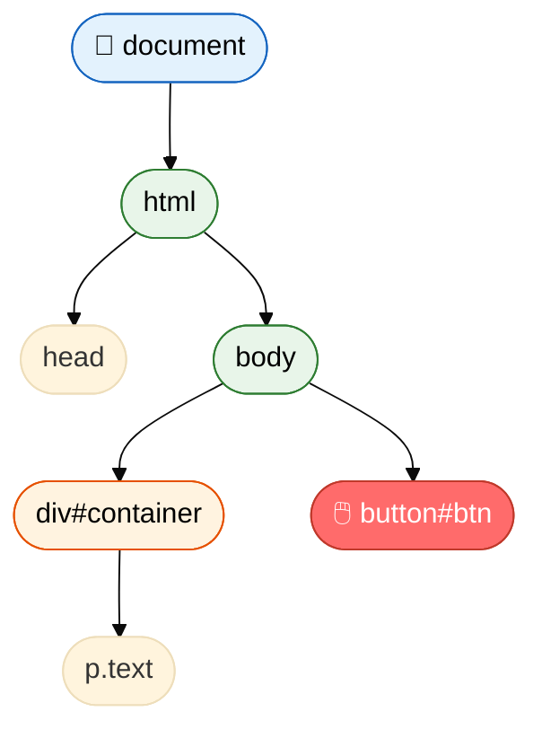
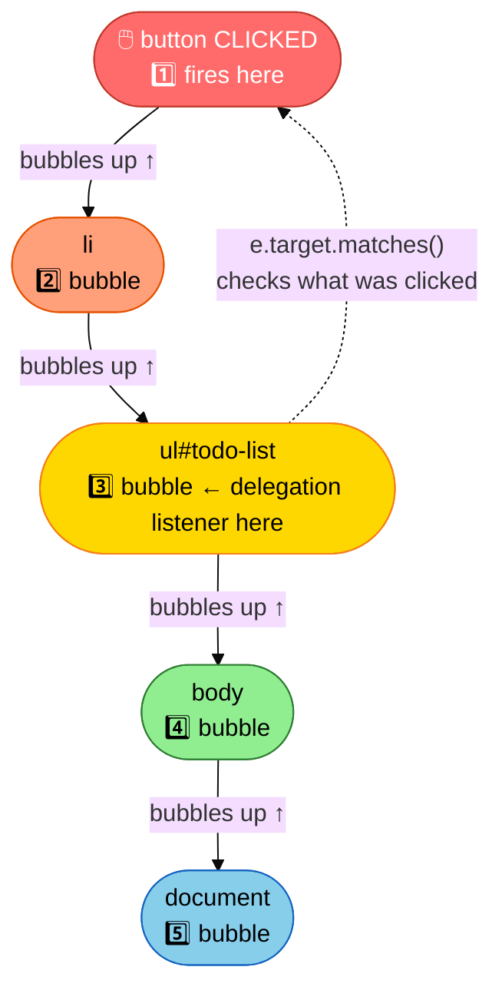

# DOM Manipulation in JavaScript

The **DOM (Document Object Model)** is a tree-like structure representing the HTML page. JavaScript can read and modify it to make pages interactive.

## Visual Overview — DOM Tree



## Visual Overview — Event Bubbling



> 💡 **Why delegation works:** a click on `button` bubbles up to `ul`. One listener on `ul` catches all child clicks.

---

## Example 1 — Basic

```js
// Selecting elements
const title = document.getElementById("title");
const btn = document.querySelector("#submit-btn");      // first match
const items = document.querySelectorAll(".list-item");  // all matches

// Reading and changing content
title.textContent = "Hello, World!";          // set text
title.innerHTML = "<strong>Hello!</strong>";  // set HTML

// Changing styles
title.style.color = "red";
title.style.fontSize = "24px";

// Adding/removing CSS classes
title.classList.add("highlight");
title.classList.remove("hidden");
title.classList.toggle("active");      // add if not there, remove if there
console.log(title.classList.contains("highlight")); // true

// Working with attributes
const link = document.querySelector("a");
console.log(link.getAttribute("href")); // get
link.setAttribute("href", "https://example.com"); // set
link.removeAttribute("disabled");       // remove

// Creating and adding elements
const newPara = document.createElement("p");
newPara.textContent = "I was created by JavaScript!";
document.body.appendChild(newPara);
```

---

## Example 2 — Intermediate

```js
// Event listeners
const button = document.querySelector("#myBtn");

button.addEventListener("click", function (event) {
  console.log("Button clicked!");
  console.log("Target:", event.target);
  console.log("Mouse position:", event.clientX, event.clientY);
});

// Common events
document.querySelector("input").addEventListener("input", (e) => {
  console.log("Typing:", e.target.value);
});

document.querySelector("form").addEventListener("submit", (e) => {
  e.preventDefault(); // stop page from reloading
  const formData = new FormData(e.target);
  console.log(Object.fromEntries(formData));
});

document.addEventListener("keydown", (e) => {
  if (e.key === "Escape") console.log("Escape pressed");
  if (e.ctrlKey && e.key === "s") {
    e.preventDefault();
    console.log("Save triggered");
  }
});

// Event Bubbling & Capturing — how events travel through the DOM
//
// Bubbling (default): event fires on target first, then travels UP to parents
// Capturing:          event fires on root first, then travels DOWN to target
//
// DOM tree:  document → body → ul#list → li → button
// Bubbling order when button is clicked: button → li → ul → body → document

document.querySelector("button").addEventListener("click", (e) => {
  console.log("1. Button clicked");
});
document.querySelector("li").addEventListener("click", (e) => {
  console.log("2. li received bubble");
});
document.querySelector("ul").addEventListener("click", (e) => {
  console.log("3. ul received bubble");
});
// Clicking the button logs: 1, then 2, then 3 (bubbles up)

// stopPropagation — stop the event from bubbling further
document.querySelector("button").addEventListener("click", (e) => {
  e.stopPropagation(); // li and ul will NOT hear this click
  console.log("Only button hears this");
});

// Capturing phase — pass 'true' as third argument
document.querySelector("ul").addEventListener("click", (e) => {
  console.log("ul captures BEFORE button fires"); // runs first
}, true); // <-- capturing mode

// Event Delegation — WHY it works: because of bubbling!
// A click on any child bubbles UP to the parent ul.
// We put ONE listener on the parent and check e.target to know what was clicked.
const list = document.querySelector("#todo-list");

list.addEventListener("click", (e) => {
  if (e.target.matches(".delete-btn")) {
    e.target.closest("li").remove(); // remove parent li
  }
  if (e.target.matches(".todo-item")) {
    e.target.classList.toggle("done");
  }
});
// Works for dynamically added items too — because they also bubble up to the same ul!
```

---

## Example 3 — Advanced

```js
// Efficient DOM updates — build HTML string then insert once
function renderList(items) {
  const list = document.querySelector("#product-list");

  const html = items
    .map(
      item => `
      <li class="product-card" data-id="${item.id}">
        <h3>${item.name}</h3>
        <p>₹${item.price}</p>
        <button class="add-to-cart">Add to Cart</button>
      </li>
    `
    )
    .join("");

  list.innerHTML = html; // single DOM update — much faster than many appends
}

const products = [
  { id: 1, name: "Laptop", price: 50000 },
  { id: 2, name: "Mouse", price: 999 },
];
renderList(products);

// Intersection Observer — lazy load when element enters viewport
const observer = new IntersectionObserver(
  (entries) => {
    entries.forEach(entry => {
      if (entry.isIntersecting) {
        const img = entry.target;
        img.src = img.dataset.src; // load real image
        img.classList.add("loaded");
        observer.unobserve(img);   // stop observing once loaded
      }
    });
  },
  { threshold: 0.1 } // trigger when 10% visible
);

document.querySelectorAll("img[data-src]").forEach(img => observer.observe(img));

// MutationObserver — watch for DOM changes
const mutationObserver = new MutationObserver((mutations) => {
  mutations.forEach(mutation => {
    mutation.addedNodes.forEach(node => {
      if (node.nodeType === 1) { // element node
        console.log("New element added:", node.tagName);
      }
    });
  });
});

mutationObserver.observe(document.body, { childList: true, subtree: true });
```
