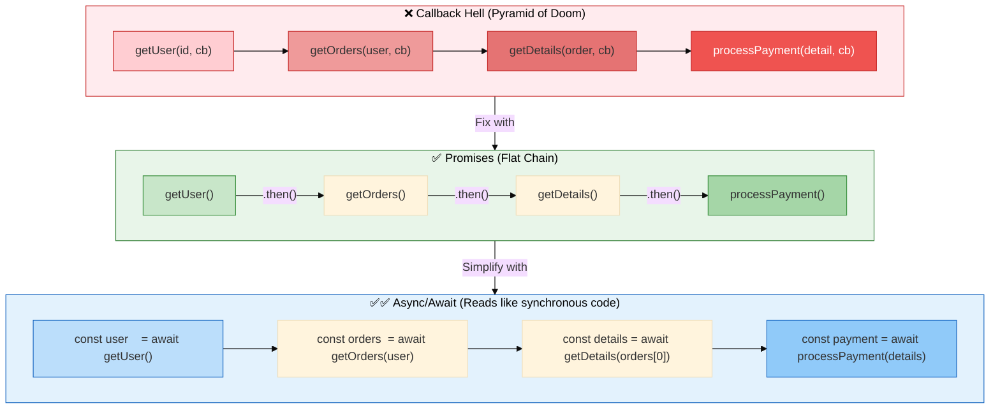

# Callbacks in JavaScript

A **callback** is a function passed as an argument to another function, and called (invoked) inside that function when a task completes.

```js
function doSomething(callback) {
  // ... do work ...
  callback(); // call the function that was passed in
}
```

### Two types:
| Type | When callback runs | Example |
|------|-------------------|---------|
| **Synchronous** | Immediately, before moving on | `Array.forEach`, `Array.map` |
| **Asynchronous** | Later, after async work finishes | `setTimeout`, `fs.readFile`, `fetch` |

---

## Visual Overview — Evolution from Callbacks to Async/Await



---

## Example 1 — Basic

```js
// Synchronous callback — runs immediately
function greet(name, callback) {
  const message = `Hello, ${name}!`;
  callback(message); // call the passed function right now
}

greet("Alice", function (msg) {
  console.log(msg); // "Hello, Alice!"
});

// Arrow function as callback (cleaner syntax)
greet("Bob", msg => console.log(msg)); // "Hello, Bob!"

// Built-in synchronous callbacks
const numbers = [1, 2, 3, 4, 5];

// forEach, map, filter — all take callbacks
numbers.forEach(n => console.log(n));          // 1 2 3 4 5
const doubled = numbers.map(n => n * 2);       // [2, 4, 6, 8, 10]
const evens = numbers.filter(n => n % 2 === 0); // [2, 4]

// Asynchronous callback — runs LATER
console.log("Before timeout");

setTimeout(function () {
  console.log("Inside timeout"); // runs after 1 second
}, 1000);

console.log("After timeout");

// Output order:
// Before timeout
// After timeout
// Inside timeout  ← runs last (async)
```

---

## Example 2 — Intermediate

```js
// Async callback pattern — Node.js style (error-first callbacks)
// Convention: first argument is always the error, second is the result
function fetchUser(userId, callback) {
  setTimeout(() => {
    const users = {
      1: { id: 1, name: "Alice" },
      2: { id: 2, name: "Bob" },
    };

    const user = users[userId];

    if (!user) {
      callback(new Error(`User ${userId} not found`), null); // error case
    } else {
      callback(null, user); // success case: error = null
    }
  }, 500);
}

// Consuming an error-first callback
fetchUser(1, function (err, user) {
  if (err) {
    console.error("Error:", err.message);
    return;
  }
  console.log("Got user:", user.name); // "Got user: Alice"
});

fetchUser(99, function (err, user) {
  if (err) {
    console.error("Error:", err.message); // "Error: User 99 not found"
    return;
  }
  console.log(user);
});

// Callbacks in event listeners
const button = document.querySelector("#btn");

// The function passed to addEventListener is a callback
button.addEventListener("click", function (event) {
  console.log("Button clicked at:", event.clientX, event.clientY);
});

// Named callback — easier to remove later
function handleClick(event) {
  console.log("Clicked:", event.target.id);
}

button.addEventListener("click", handleClick);
button.removeEventListener("click", handleClick); // named callbacks can be removed
```

---

## Example 3 — Advanced

```js
// ❌ CALLBACK HELL (Pyramid of Doom)
// When callbacks are nested inside callbacks — becomes unreadable
function getUser(id, callback) {
  setTimeout(() => callback(null, { id, name: "Alice" }), 300);
}
function getOrders(userId, callback) {
  setTimeout(() => callback(null, ["book", "pen"]), 300);
}
function getOrderDetails(orderId, callback) {
  setTimeout(() => callback(null, { item: orderId, price: 200 }), 300);
}
function processPayment(details, callback) {
  setTimeout(() => callback(null, { status: "paid", amount: details.price }), 300);
}

// This is callback hell — deeply nested, hard to read, hard to handle errors
getUser(1, function (err, user) {
  if (err) return console.error(err);
  console.log("User:", user.name);

  getOrders(user.id, function (err, orders) {
    if (err) return console.error(err);
    console.log("Orders:", orders);

    getOrderDetails(orders[0], function (err, details) {
      if (err) return console.error(err);
      console.log("Details:", details);

      processPayment(details, function (err, payment) {
        if (err) return console.error(err);
        console.log("Payment:", payment.status); // finally here — 4 levels deep!
      });
    });
  });
});

// ✅ FIX 1: Flatten with named functions (avoids nesting)
function onPayment(err, payment) {
  if (err) return console.error(err);
  console.log("Payment:", payment.status);
}
function onDetails(err, details) {
  if (err) return console.error(err);
  processPayment(details, onPayment);
}
function onOrders(err, orders) {
  if (err) return console.error(err);
  getOrderDetails(orders[0], onDetails);
}
function onUser(err, user) {
  if (err) return console.error(err);
  getOrders(user.id, onOrders);
}
getUser(1, onUser); // same logic, much flatter

// ✅ FIX 2: Convert callbacks to Promises (best solution)
function getUserPromise(id) {
  return new Promise((resolve, reject) => {
    getUser(id, (err, data) => (err ? reject(err) : resolve(data)));
  });
}
function getOrdersPromise(userId) {
  return new Promise((resolve, reject) => {
    getOrders(userId, (err, data) => (err ? reject(err) : resolve(data)));
  });
}
function getOrderDetailsPromise(orderId) {
  return new Promise((resolve, reject) => {
    getOrderDetails(orderId, (err, data) => (err ? reject(err) : resolve(data)));
  });
}
function processPaymentPromise(details) {
  return new Promise((resolve, reject) => {
    processPayment(details, (err, data) => (err ? reject(err) : resolve(data)));
  });
}

// ✅ Now use async/await — clean, flat, readable
async function checkout(userId) {
  const user = await getUserPromise(userId);
  console.log("User:", user.name);

  const orders = await getOrdersPromise(user.id);
  console.log("Orders:", orders);

  const details = await getOrderDetailsPromise(orders[0]);
  console.log("Details:", details);

  const payment = await processPaymentPromise(details);
  console.log("Payment:", payment.status); // "paid"
}

checkout(1);

// Node.js built-in: util.promisify — auto-converts error-first callbacks
const { promisify } = require("util");
const fs = require("fs");

const readFile = promisify(fs.readFile); // converts callback to promise

// Now use it with async/await
async function readConfig() {
  const content = await readFile("config.json", "utf8");
  return JSON.parse(content);
}
```

---

## Callback vs Promise vs Async/Await — Comparison

```js
// Same task: fetch user → fetch their orders → log result

// ❌ Callbacks — nested, hard to read
getUser(1, (err, user) => {
  getOrders(user.id, (err, orders) => {
    console.log(orders);
  });
});

// ✅ Promises — flat chain
getUserPromise(1)
  .then(user => getOrdersPromise(user.id))
  .then(orders => console.log(orders))
  .catch(err => console.error(err));

// ✅✅ Async/Await — reads like synchronous code (best)
async function run() {
  const user = await getUserPromise(1);
  const orders = await getOrdersPromise(user.id);
  console.log(orders);
}
```

> **Rule of thumb:** Use callbacks only when forced to (legacy APIs, event listeners).
> For everything else, use **Promises** or **async/await**.
